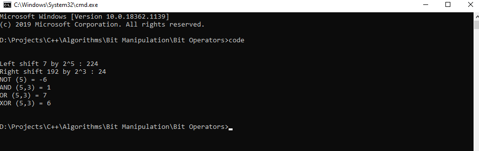

# Bit Operators

Computer understands only 2 bits, 0 (OFF) or 1 (ON).
Working on bit level increases the operation time and task is completed in minimal time.

## Output for the code

### Thanks For Reading